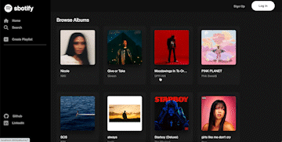

# Welcome to sbotify

### Introduction

sbotify is a clone of the Spotify web player. Spotify is a music streaming service that allows users to browse through and play songs from albums, artists, various pre-made playlists. A Spotify user that is not logged in is only allowed to browse and search for these features. They can not play any songs. Once logged in, the user is able to not only play songs, but curate playlists that will show up in their library. They can update or delete existing playlist that they've created. sbotify contains many features that the Spotify web player has and uses the following technologies:

* Languages: Javascript, Ruby, HTML, CSS,
* Frontend: React-Redux
* Database: PostgreSQL
* Hosting: Render
* Asset Storage: AWS (S3)

# Feature List
## Albums and Songs
a sbotify user is able to browse through existing data of albums that contains songs whether they are logged in or not:



``` javascript
     <ul id='album-container'>
        {albums.map(album => (
         <AlbumShowItem key={album.id} album={album}/>
         ))}
     </ul>
```

Each <AlbumShowItem/>
``` javascript
        <div className='album-components'>
            <Link to={`/albums/${album.id}`} className='nav-link'>
            <div className='inner-album-components'>
                    <div className='album-pics'>
                        
                    </div>
                    <div className='titleartist'>{album.name}</div>
                    <div className='titleartist' id='artistname'>{artist.name}</div>
                

            </div>
            </Link>
        </div>

```
